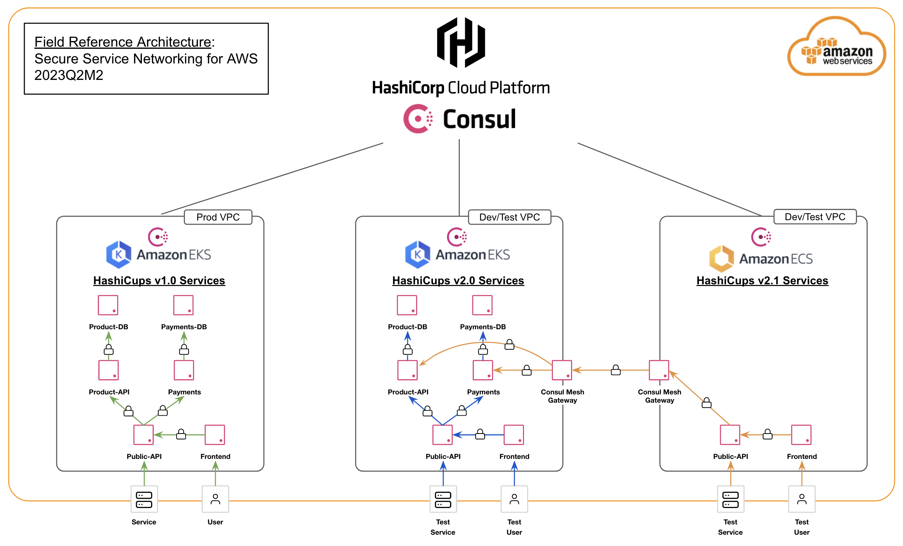

# Secure Service Networking for AWS
Secure Service Networking for AWS w/ HashiCorp Consul

## Table of Contents

- [Architecture Overview](#Architecture%20Overview) 
- [Build Environment](#Build%20Environment) 
- [Deployment Patterns](#Deployment%20Patterns) 
- [Documentation and Troubleshooting](#Documentation%20and%20Troubleshooting)

---

# Architecture Overview

Using AWS and HCP Credentials, you can create the architecture deployments contained within this repository. Each deployment is a variation of the Secure Service Networking for AWS Field Reference Architecture depicted in the diagram below.



Architecture details, documentation, and troubleshooting guidance for each deployment pattern can be found in the FRA-SSN-AWS [Wiki](https://github.com/hashicorp/fra-ssn-aws/wiki).

---

# Build Requirements

Each deployment pattern in the Secure Service Networking for AWS Field Reference Architecture the [HashiCorp Cloud Platform (HCP)](https://cloud.hashicorp.com/) and hence require both AWS credentials and HCP credentials. 

To successfully run any of the deployments you will need to set the following environment variables:

```sh
AWS_ACCESS_KEY_ID
AWS_SECRET_ACCESS_KEY
HCP_CLIENT_ID
HCP_CLIENT_SECRET
```

For details on acquiring HCP credentials, and testing both AWS and HCP authentication using terraform, please visit the [Authentication Credentials](https://github.com/hashicorp/fra-ssn-aws/wiki/Authentication-Credentials) page of the Wiki.

Each deployment pattern has its own README.md containing deploment specific details.

---

# Deployment Patterns

Variations of the Field Reference Architecture for Secure Service Networking on AWS (FRA-SSN-AWS) cam be found in the `deployments/` directory.

---

# Documentation and Troubleshooting

Documentation and Troubleshooting guidance can be found in the FRA-SSN-AWS Wiki:
https://github.com/hashicorp/fra-ssn-aws/wiki